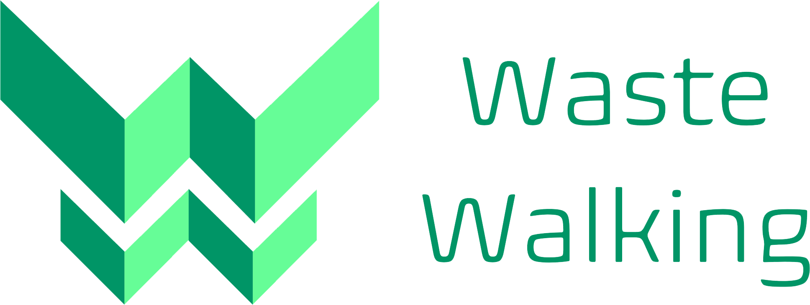

<div align="center">



[](https://github.com/WasteWalking/Frontend_WasteWalking/blob/master/LICENSE)
[](http://standardjs.com/)  

##### A website for managing trash pickup events

</div>

**Description**:  The projects aim is to deliver a platform for trash pickup events which is simple to use. This repository develops the frontend part of the platform. 

Other things to include:

  - **Technology stack**: The Frontend bases on Next.js. Apollo is used for the GraphQL Backend connection.
  - **Status**:  This project is still in an early Alpha state and will probably continue to stay in it until 2022. More information can be found in the [CHANGELOG](CHANGELOG.md).
  - **Live Demo**: A live demo can be found here: https://thankful-beach-09b501e03.azurestaticapps.net


## Installation

### Running the development server.

```bash
    npm run dev
```

### Building for production.

```bash
    npm run build
```

### Running the production server.

```bash
    npm run start
```

### Linting & formatting your code.

```bash
    npm run lint
```

## Known issues

None at the moment

## Getting help

If you have questions, concerns, bug reports, etc, please file an issue in this repository's Issue Tracker.

## Getting involved

General instructions on _how_ to contribute can be found in [CONTRIBUTING](CONTRIBUTING.md).


----

## Open source licensing info
1. [TERMS](TERMS.md)
2. [LICENSE](LICENSE)

----